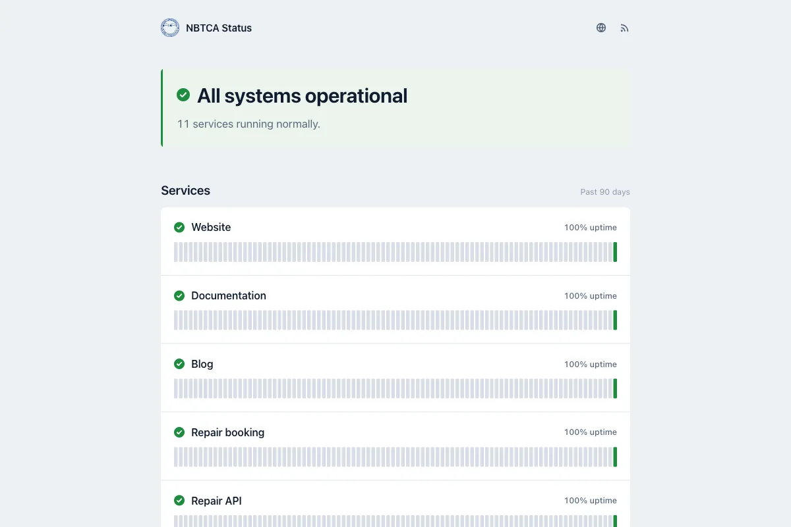

<h1 align="center">heartbeat</h1>

<p align="center">Status page and uptime monitor for NBTCA, on Cloudflare Workers and D1.</p>

<p align="center">
  <a href="https://status.nbtca.space"></a>
  <a href="https://github.com/nbtca/heartbeat/actions/workflows/deploy.yml"></a>
</p>

<p align="center"></p>

- Checked every minute from Cloudflare's edge and from a probe inside the China cluster
- Two failures in a row before a service is marked down; a probe that stops reporting is ignored, not counted as an outage
- 90 days of uptime per service, a live 60-minute trace, latency and TLS expiry per region
- Incidents and maintenance windows written as Markdown in the repo
- English at `/`, Chinese at `/zh`
- No dependencies: one Worker, one D1 database

## Adding a service

```ts
// monitors.ts
{
  name: 'Repair service',
  zh: '维修服务',
  items: [
    { id: 'repair', name: 'Repair booking', role: 'Sunday, repair.nbtca.space', zh: 'Sunday，repair.nbtca.space', http: 'https://repair.nbtca.space' },
    { id: 'api', name: 'Repair API', role: 'Saturday, api.nbtca.space', zh: 'Saturday，api.nbtca.space', http: 'https://api.nbtca.space/ping' },
  ],
}
```

Name a monitor after what a member would recognise — a hostname when that is the clearest label, otherwise what it does — and use `role` for the project behind it and where it lives, with `zh` as the Chinese version. A monitor takes `http` or `tcp`, then optionally `status` when the endpoint answers something other than 2xx (a registry's `/v2/` answers `401`), `expect` for a substring the body must contain, `slowMs` to move the slow threshold off 3000, `regions` to check from one side only, `head` to ask for headers only, and `every` to check less often than once a minute when the target rate-limits or is expensive to reach.

A group marked `infra: true` collapses below the main panel, and the headline and `/api/status` ignore it, so an internal tool going down does not tell a visitor the site is broken. It is still checked and still alerts.

Page copy is in [`src/text.ts`](src/text.ts); both languages must define the same keys or the build fails.

## Writing an incident

Add `incidents/<slug>.md` and merge to `main`. English only, times are China time.

```md
---
title: Repair bookings could not be submitted
impact: major
components: repair, api
---

## identified 2026-09-10 21:43
The database connection pool was exhausted. Scaling it up.

## resolved 2026-09-10 23:24
Pool resized, the service is back.
```

`impact` is `minor`, `major` or `critical`, and holds the listed components at degraded, partial or major until the `resolved` update. `impact: maintenance` takes `start` and `end` instead, and a `## completed` update ends that window early.

## Setup

```sh
npx wrangler d1 create heartbeat          # put the id into wrangler.jsonc
npx wrangler secret put PROBE_TOKEN
npx wrangler secret put NOTIFY_TOKEN      # matches the heartbeat key in notification-center
kubectl create secret generic heartbeat-probe --from-literal=token=<PROBE_TOKEN>
kubectl apply -f probe/deploy.yaml
```

Pushing to `main` deploys once the `CLOUDFLARE_API_TOKEN` secret and `CLOUDFLARE_ACCOUNT_ID` variable exist.

## Development

```sh
npm ci && npm test && npm run check
echo 'PROBE_TOKEN=dev' > .dev.vars
npx wrangler d1 migrations apply heartbeat --local
npm run dev
curl 'http://localhost:8787/__scheduled?cron=*+*+*+*+*'
HEARTBEAT_URL=http://localhost:8787 PROBE_TOKEN=dev npm run probe
```

`GET /api/status` returns the state the page shows. Alerts go to `NOTIFY_URL` as `{ source, text, url, monitor, state, previous, ts }`.

[`src/logo.svg`](src/logo.svg) is the association's seal from the `NBTCA - LOGO` master; the `favicon.svg` on nbtca.space is Astro's default, not the mark.
